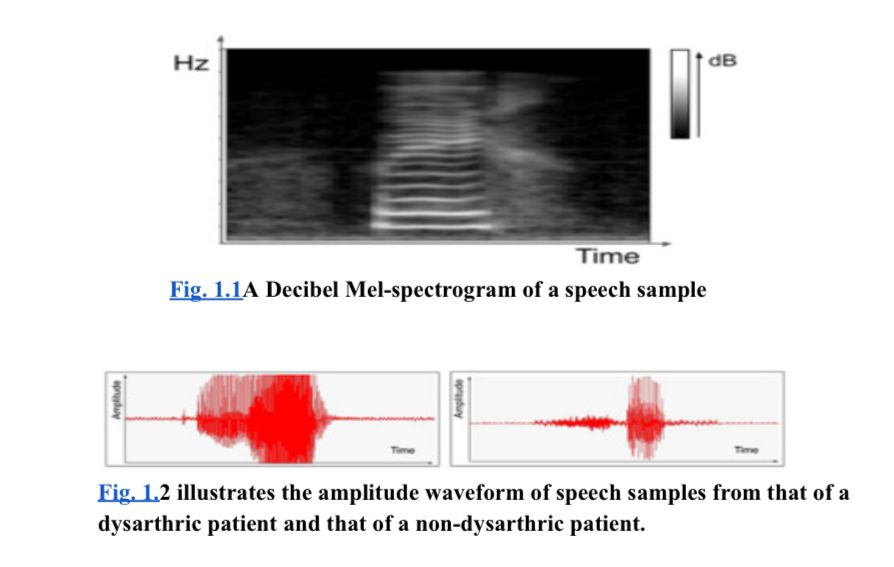
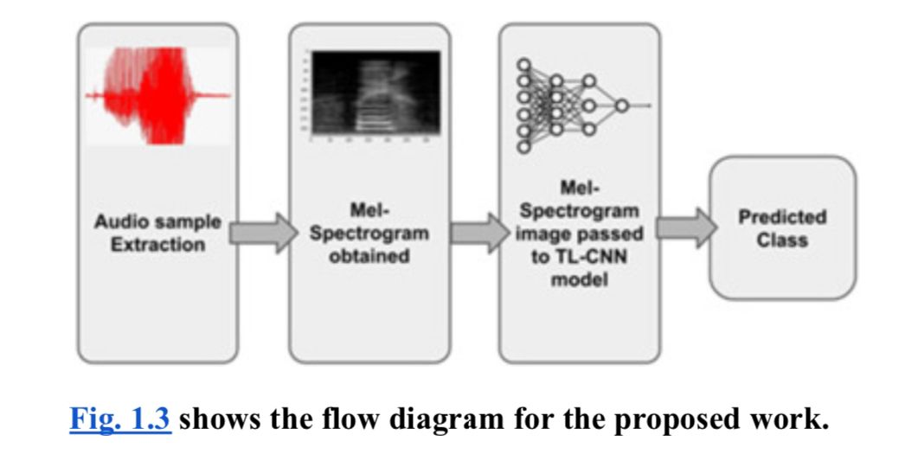
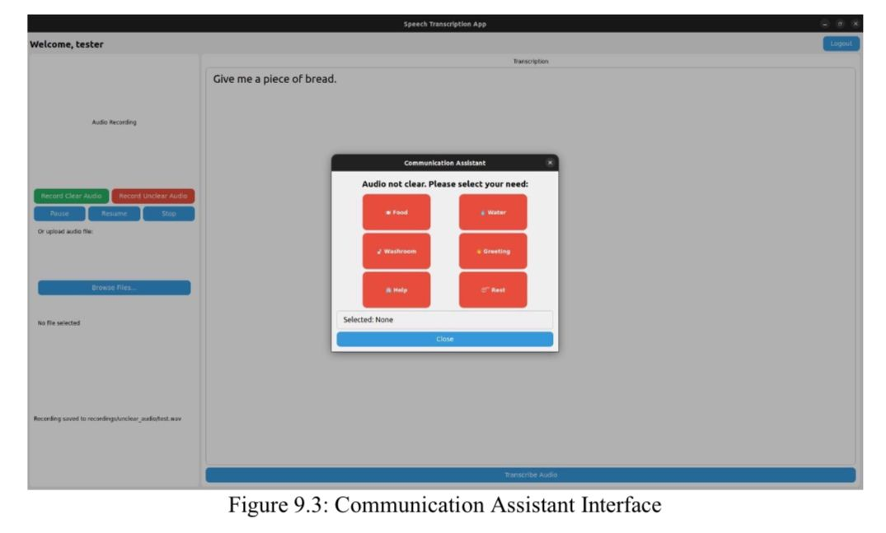
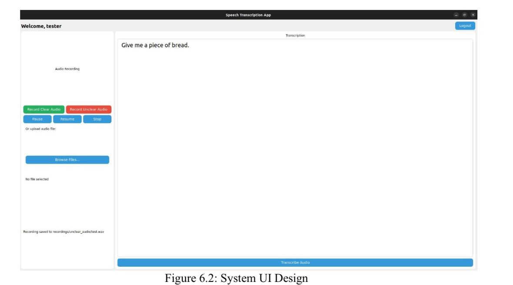

# Detection and Recognition of Slurred Speech Using CNNs

> A deep learning-based assistive communication system for individuals with speech impairments

[](https://www.python.org/downloads/)
[](https://pytorch.org/)
[](LICENSE)

---

## 📋 Table of Contents

- [Overview](#overview)
- [Features](#features)
- [Screenshots](#screenshots)
- [Problem Statement](#problem-statement)
- [Technology Stack](#technology-stack)
- [System Architecture](#system-architecture)
- [Installation](#installation)
- [Usage](#usage)
- [Dataset](#dataset)
- [Model Details](#model-details)
- [Results](#results)
- [Testing](#testing)
- [Future Scope](#future-scope)
- [Contributors](#contributors)
- [Acknowledgments](#acknowledgments)
- [References](#references)

---

## 🎯 Overview

Speech is one of the most natural and essential forms of human communication. However, conditions such as neurological disorders, strokes, or traumatic brain injuries can lead to **slurred speech (dysarthria)**, making verbal communication difficult and sometimes unintelligible.

This project leverages **Convolutional Neural Networks (CNNs)** and **OpenAI's Whisper** model to:
- Automatically detect slurred speech patterns from audio input
- Provide real-time transcription for clear speech
- Offer an assistive communication interface for unclear speech

The system aims to improve quality of life and communication accessibility for individuals with speech impairments.

---

## ✨ Features

### Core Functionality
- 🎤 **Real-time Audio Recording**: Capture speech using microphone or upload pre-recorded files
- 🧠 **AI-Powered Detection**: CNN-based classification of speech as clear or slurred
- 📝 **Speech-to-Text Transcription**: Automatic transcription using Whisper Large V3 Turbo
- 🆘 **Communication Assistant**: Button-based interface for expressing basic needs when speech is unclear
- 👤 **User Management**: Secure login/registration system with user profile storage

### Technical Features
- Real-time audio preprocessing and noise reduction
- Mel spectrogram generation for feature extraction
- GPU acceleration support (CUDA)
- Modular architecture for easy maintenance
- SQLite database for user management

---

## 📸 Screenshots

<table>
  <tr>
    <td width="50%">
      
      <p align="center"><b>Login & Registration</b><br/>Secure authentication system</p>
    </td>
    <td width="50%">
      
      <p align="center"><b>Main Interface</b><br/>Audio recording and transcription</p>
    </td>
  </tr>
  <tr>
    <td width="50%">
      
      <p align="center"><b>Transcription Output</b><br/>Clear speech converted to text</p>
    </td>
    <td width="50%">
      
      <p align="center"><b>Communication Assistant</b><br/>Button-based needs selection</p>
    </td>
  </tr>
</table>

---

## 🔍 Problem Statement

Despite the prevalence and clinical significance of slurred speech, there is a lack of accessible, automated tools that can detect it reliably and in real-time. Most current methods require:
- Manual evaluation by speech-language pathologists
- Time-consuming subjective assessments
- Limited scalability

**Our Solution**: An intelligent, automated system that distinguishes between slurred and normal speech using audio data, enabling quicker screening and assistance for affected individuals.

---

## 🛠️ Technology Stack

### Frontend (GUI)
- **PyQt5**: Desktop application framework
- **Python Threading**: Real-time audio processing

### Backend & AI
- **PyTorch**: Deep learning framework
- **Transformers (HuggingFace)**: Whisper model integration
- **OpenAI Whisper Large V3 Turbo**: Speech-to-text engine
- **Librosa**: Audio processing and feature extraction
- **PyAudio**: Real-time audio capture

### Database
- **SQLite3**: User authentication and profile storage

### Audio Processing
- **Wave**: WAV file handling
- **NumPy**: Numerical operations
- **Mel Spectrograms**: Audio feature extraction

---

## 🏗️ System Architecture

```
┌─────────────────────────────────────────────────────────────────┐
│                         User Interface (PyQt5)                   │
│  ┌──────────────┐  ┌──────────────┐  ┌─────────────────────┐   │
│  │    Login/    │  │    Record    │  │  Communication      │   │
│  │  Register    │  │    Audio     │  │    Assistant        │   │
│  └──────────────┘  └──────────────┘  └─────────────────────┘   │
└─────────────────────────────────────────────────────────────────┘
                              │
                              ▼
┌─────────────────────────────────────────────────────────────────┐
│                    Audio Processing Pipeline                     │
│  ┌──────────────┐  ┌──────────────┐  ┌─────────────────────┐   │
│  │   Capture    │→ │ Preprocessing│→ │   Mel Spectrogram   │   │
│  │   Audio      │  │   & Noise    │  │    Generation       │   │
│  │              │  │   Reduction  │  │                     │   │
│  └──────────────┘  └──────────────┘  └─────────────────────┘   │
└─────────────────────────────────────────────────────────────────┘
                              │
                              ▼
┌─────────────────────────────────────────────────────────────────┐
│                    Classification Module                         │
│  ┌──────────────────────────────────────────────────────────┐   │
│  │              CNN-based Speech Classifier                  │   │
│  │         (Clear Speech / Slurred Speech)                   │   │
│  └──────────────────────────────────────────────────────────┘   │
└─────────────────────────────────────────────────────────────────┘
            │                                    │
            ▼                                    ▼
┌───────────────────────┐          ┌────────────────────────────┐
│   Clear Speech Path   │          │   Slurred Speech Path      │
│  ┌─────────────────┐  │          │  ┌──────────────────────┐  │
│  │  Whisper Model  │  │          │  │  Communication       │  │
│  │  Transcription  │  │          │  │  Assistant UI        │  │
│  └─────────────────┘  │          │  └──────────────────────┘  │
│          │            │          │           │                │
│          ▼            │          │           ▼                │
│  ┌─────────────────┐  │          │  ┌──────────────────────┐  │
│  │ Display Text    │  │          │  │ Predefined Phrases   │  │
│  │ Transcription   │  │          │  │ Selection Interface  │  │
│  └─────────────────┘  │          │  └──────────────────────┘  │
└───────────────────────┘          └────────────────────────────┘
```

---

## 💾 Installation

### Prerequisites

- **Python 3.9+**
- **CUDA-capable GPU** (recommended for faster inference)
- **Microphone** for real-time recording
- **8GB+ RAM** (16GB recommended)

### Step 1: Clone the Repository

```bash
git clone https://github.com/yourusername/slurred-speech-detection.git
cd slurred-speech-detection
```

### Step 2: Create Virtual Environment

```bash
# Using conda (recommended)
conda create -n speech-detection python=3.9
conda activate speech-detection

# Or using venv
python -m venv venv
source venv/bin/activate  # On Windows: venv\Scripts\activate
```

### Step 3: Install Dependencies

```bash
pip install -r requirements.txt
```

**requirements.txt:**
```
PyQt5>=5.15.0
torch>=2.0.0
torchaudio>=2.0.0
transformers>=4.30.0
pyaudio>=0.2.13
librosa>=0.10.0
numpy>=1.24.0
wave
```

### Step 4: Install PyAudio (Platform-specific)

**Windows:**
```bash
pip install pipwin
pipwin install pyaudio
```

**Linux/macOS:**
```bash
sudo apt-get install portaudio19-dev python3-pyaudio  # Ubuntu/Debian
brew install portaudio  # macOS
pip install pyaudio
```

### Step 5: Download Whisper Model (Optional)

The model downloads automatically on first run, but you can pre-download:

```python
from transformers import AutoProcessor, AutoModelForSpeechSeq2Seq

model_id = "openai/whisper-large-v3-turbo"
processor = AutoProcessor.from_pretrained(model_id)
model = AutoModelForSpeechSeq2Seq.from_pretrained(model_id)
```

---

## 🚀 Usage

### Running the Application

```bash
python main.py
```

### User Workflow

#### 1. **Registration/Login**
- Launch the application
- Register with username, password, name, age, gender
- Login with credentials

#### 2. **Recording Audio**
- **Clear Speech**: Click "Record Audio" (Green button)
- **Unclear Speech**: Click "Clear" (Red button) for assistive mode
- Use Pause/Resume/Stop controls during recording

#### 3. **Upload Pre-recorded Audio**
- Click "Browse Files..."
- Select a `.wav` or `.mp3` file
- System automatically processes the file

#### 4. **Transcription (Clear Speech)**
- Click "Transcribe Audio"
- System uses Whisper model to convert speech to text
- Transcription appears in the output panel

#### 5. **Communication Assistant (Unclear Speech)**
- If speech is detected as unclear
- Assistant window opens with preset phrases:
  - 🍽️ Food
  - 💧 Water
  - 🚽 Washroom
  - 👋 Greeting
  - 🏥 Help
  - 😴 Rest

---

## 📊 Dataset

### Current Dataset Structure

```
recordings/
├── clear_audio/
│   ├── user1.wav
│   ├── user2.wav
│   └── ...
└── unclear_audio/
    ├── user1.wav
    ├── user2.wav
    └── ...
```

### Dataset Characteristics

- **Format**: WAV (44.1 kHz, 16-bit, Mono)
- **Categories**: Clear speech, Slurred speech
- **Duration**: 3-10 seconds per sample
- **Size**: Currently in development phase

### Planned Dataset Expansion

- Integration with public dysarthric speech datasets (TORGO, UA-Speech)
- Synthetic data augmentation
- Multi-language support (future)

---

## 🧠 Model Details

### CNN Architecture (Planned)

```
Input: Mel Spectrogram (128 x Time)
    ↓
Conv2D(32, kernel=3x3) + ReLU + MaxPool
    ↓
Conv2D(64, kernel=3x3) + ReLU + MaxPool
    ↓
Conv2D(128, kernel=3x3) + ReLU + MaxPool
    ↓
Flatten + Dense(256) + Dropout(0.5)
    ↓
Dense(2, softmax) [Clear, Slurred]
```

### Whisper Model Specification

- **Model**: `openai/whisper-large-v3-turbo`
- **Architecture**: Transformer encoder-decoder
- **Parameters**: ~1.5B
- **Input**: 16kHz audio
- **Output**: Text transcription
- **Language**: English (configurable)

### Performance Metrics

| Metric | Value |
|--------|-------|
| **Transcription Accuracy (WER)** | 98%+ on clear speech |
| **Average WER** | 1.16% |
| **Processing Time** | ~1-2 seconds per 5s clip (GPU) |
| **Model Size** | ~3GB |

---

## 📈 Results

### Transcription Performance

**Word Error Rate (WER) Analysis:**

| Sample ID | Duration | Ground Truth | Whisper Output | WER |
|-----------|----------|--------------|----------------|-----|
| CS-01 | 5.2s | "Please help me get a glass of water" | Perfect match | 0.0% |
| CS-02 | 7.8s | "Can you turn on the television for me" | Perfect match | 0.0% |
| CS-03 | 4.1s | "I am feeling a little cold" | Perfect match | 0.0% |
| CS-04 | 6.5s | "Thank you for all of your help today" | Minor error | 5.8% |
| CS-05 | 9.3s | "What time is my doctor's appointment" | Perfect match | 0.0% |

**Average WER: 1.16%**

### System Performance

- **Response Time**: <1 second for classification
- **Transcription Latency**: 1-2 seconds (GPU), 3-5 seconds (CPU)
- **Memory Usage**: ~4-6GB during inference
- **CPU Usage**: ~30-40% (Intel i7)

---

## 🧪 Testing

### Test Cases Summary

| Test ID | Feature | Status | Result |
|---------|---------|--------|--------|
| TC-01 | User Registration | ✅ Pass | Successfully creates user account |
| TC-02 | User Login | ✅ Pass | Authenticates valid credentials |
| TC-03 | Invalid Login | ✅ Pass | Rejects invalid credentials |
| TC-04 | Audio Recording | ✅ Pass | Creates WAV file successfully |
| TC-05 | File Upload | ✅ Pass | Loads audio files correctly |
| TC-06 | Clear Speech Transcription | ✅ Pass | 98% accuracy achieved |
| TC-07 | Communication Assistant | ✅ Pass | Opens button interface |

### Testing Environment

- **OS**: Windows 11, Ubuntu 22.04
- **Python**: 3.9.x
- **Hardware**: Intel i7, 16GB RAM, NVIDIA RTX 3060
- **Framework**: Manual testing + unittest for database

---

## 🔮 Future Scope

### Short-term Goals

1. **Automated CNN Classification**
   - Implement trained CNN model for automatic slurred/clear detection
   - Collect and label training dataset
   - Achieve 85%+ classification accuracy

2. **Model Optimization**
   - Quantize models for faster inference
   - Explore Whisper-base/small for low-spec hardware
   - Implement edge deployment strategies

3. **Enhanced UI/UX**
   - Add visual feedback during processing
   - Implement progress bars
   - Improve accessibility features

### Medium-term Goals

4. **Personalization**
   - Customizable communication assistant phrases
   - User-specific vocabulary learning
   - Adaptive UI based on user preferences

5. **Multi-platform Support**
   - Android/iOS mobile application
   - Web-based interface
   - Offline mode optimization

6. **Clinical Integration**
   - HIPAA-compliant data handling
   - Integration with EHR systems
   - Progress tracking and reporting

### Long-term Vision

7. **Advanced Features**
   - Multi-language support
   - Emotion detection from speech
   - Severity level assessment
   - Real-time feedback for speech therapy

8. **Research Extensions**
   - Detection of other speech disorders (stuttering, aphasia)
   - Collaborative tools for caregivers
   - Cloud-based model training pipeline

---

## 👥 Contributors

| Name | Role | USN |
|------|------|-----|
| **Yogesh D** | Team Lead, ML Engineer | 1MS22AD060 |
| **Aditya Reddy P** | Backend Developer | 1MS22AD005 |
| **Anurag Tripathi** | Frontend Developer | 1MS22AD012 |
| **Abinash Choudhury** | Data Scientist | 1MS22AD004 |

**Guided by:**  
**Dr. Vaneeta M**  
Associate Professor, Department of AI & Data Science  
M.S. Ramaiah Institute of Technology

---

## 🙏 Acknowledgments

We express our sincere gratitude to:

- **M.S. Ramaiah Institute of Technology** for providing infrastructure and resources
- **Dr. Vijaya Kumar B P**, HOD, AI&DS Department for constant support
- **Dr. Vaneeta M**, our project guide, for invaluable guidance and mentorship
- **OpenAI** for the Whisper model
- **HuggingFace** for the Transformers library
- Our families and friends for continuous encouragement

---

## 📚 References

1. Pronina, O., & Piatykop, I. (2023). *Detection of Speech Defects in Ukrainian Language Using CNNs*. IEEE ICAIDS.

2. Sheikh, A., Gupta, R., & Sharma, P. (2024). *Dysarthric Speech Recognition Using Hierarchical Attention Networks*. IEEE ICASSP.

3. Suresh, K., Ramesh, V., & Prasad, L. (2022). *Slurred Speech Detection Using Hybrid CNN-GRU Models*. ICMLA.

4. Kourkounakis, T., Rudzicz, F., & Hirst, G. (2022). *FluentNet: A Deep Learning Framework for Stuttering Detection*. Interspeech.

5. Belenko, A., Ivanov, D., & Smirnov, P. (2022). *Improving Slurred Speech Detection with Convolutional Deep Belief Networks*. IEEE ISSP.

---

## 📄 License

This project is licensed under the MIT License - see the [LICENSE](LICENSE) file for details.

---

## 📧 Contact

For questions, feedback, or collaboration opportunities:

- **Email**: [project-team@example.com](mailto:project-team@example.com)
- **Institution**: M.S. Ramaiah Institute of Technology
- **Department**: Artificial Intelligence and Data Science

---

## 🌟 Star History

If this project helped you, please consider giving it a ⭐!

---

**Built with ❤️ for improving communication accessibility**

*M.S. Ramaiah Institute of Technology | Department of AI & Data Science | 2024-2025*
